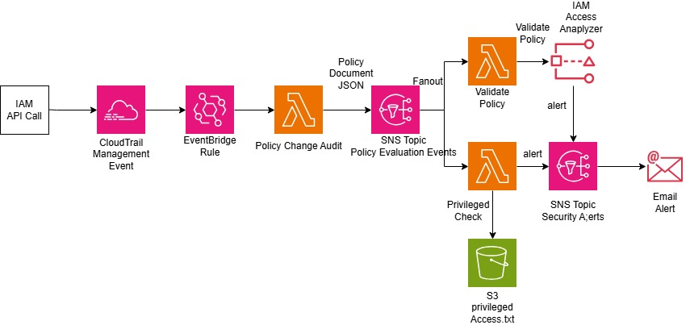

## Architecture

## The solution consists of:

# CloudTrail
Captures IAM management API events including:
* CreatePolicy
* CreatePolicyVersion
* AttachRolePolicy
* PutRolePolicy
* PutUserPolicy
* SetDefaultPolicyVersion
  
# EventBridge
Routes IAM management events to Lambda for real-time policy evaluation.

# Lambda 1 – IAM Policy Change Audit
Collects IAM policy changes and publishes policy metadata to SNS.

# Lambda 2 – IAM Policy Validator
Uses IAM Access Analyzer ValidatePolicy API to detect:
* Wildcard resources
* Missing conditions
* Security warnings
* IAM policy best-practice violations

# Lambda 3 – Custom Privileged Action Checker

Implements organization-specific governance by checking policies against a centrally managed list of privileged IAM actions stored in Amazon S3.

Examples include:

* iam:PassRole
* iam:CreateRole
* organizations:CreateAccount
* cloudtrail:DeleteTrail

# Lambda 4 – Unused Access Monitoring

Processes IAM Access Analyzer unused-access findings and notifies security teams when IAM entities have excessive or unused permissions.

# Amazon SNS

Publishes real-time notifications to security teams.

##  Benefits
* Fully serverless
* Event-driven architecture
* AWS native services only
* Infrastructure as Code using Terraform
* Supports security operations teams
* Enables continuous IAM governance
* Detects policy misconfigurations in near real time
* Supports least-privilege initiatives

## AWS Services Used
* IAM
* IAM Access Analyzer
* CloudTrail
* EventBridge
* Lambda
* SNS
* S3
* CloudWatch

## IAC
* Terraform

## Deployment

terraform init

terraform plan

terraform apply

## Validation

# 1. Create an IAM policy containing:
{
  "Action":"iam:PassRole",
  "Resource":"*"
}

# 2. Observe:
* Lambda execution
* CloudWatch logs
* SNS notifications
* Policy validation findings

## Architecture Principles
* Serverless
* Event Driven
* Least Privilege
* Security by Design
* Infrastructure as Code
* AWS Well-Architected Framework
